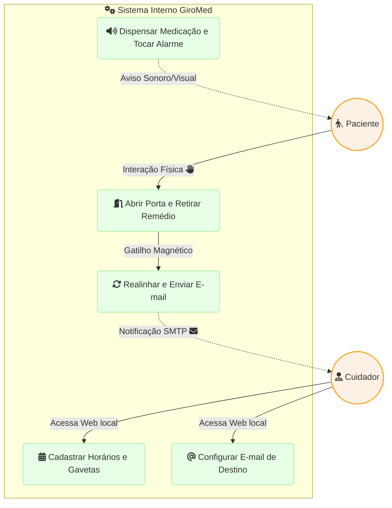
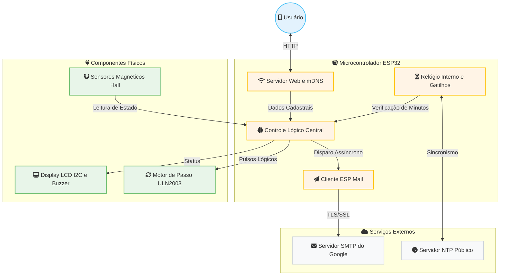

# **GiroMed: Um Dispensador Automatizado de Medicamentos com Interface Web para o Cuidado de Idosos**

 

**Giovani Bellini**

1 Engenharia de Computação – Pontifícia Universidade Católica de Campinas (PUC-Campinas) 
Campinas – SP – Brasil

`giovanibelliniestudos@gmail.com`

 

> **Abstract.** *This paper presents GiroMed, an automated medicine dispenser designed to assist elderly individuals in managing their medication schedules. Built with an ESP32 microcontroller, stepper motors, and magnetic sensors, the system dispenses pills into 21 slots based on a pre-programmed calendar. Caregivers can manage schedules and receive email alerts through a local web interface. The solution aims to reduce medication errors and provide a reliable, automated assistance tool for home care.*

> **Resumo.** *Este artigo apresenta o GiroMed, um dispensador automático de medicamentos desenvolvido para auxiliar idosos no gerenciamento de seus horários de medicação. Construído com um microcontrolador ESP32, motores de passo e sensores magnéticos, o sistema dispensa comprimidos em 21 gavetas com base em um calendário pré-programado. Cuidadores podem gerenciar horários e receber alertas por e-mail através de uma interface web local. A solução visa reduzir erros de medicação e aumentar a segurança.*

 

## **1. Introdução**

O envelhecimento populacional traz desafios significativos para a saúde pública e familiar, especialmente no que tange à adesão a tratamentos medicamentosos. O esquecimento de horários ou a dosagem incorreta são problemas recorrentes na rotina do público alvo idoso, o que compromete a eficácia dos tratamentos.

&nbsp;&nbsp;&nbsp;&nbsp;Nesse contexto, a aplicação de sistemas embarcados oferece uma oportunidade viável para automação domiciliar. O projeto GiroMed surge como uma máquina inteligente capaz de armazenar remédios e dispensá-los para consumo no momento exato, notificando os responsáveis sobre as rotinas diárias.

## **2. Arquitetura do Sistema e Casos de Uso**

A concepção do projeto baseia-se na separação das responsabilidades de gerenciamento lógico e controle físico. Para guiar o desenvolvimento, foram estabelecidos casos de uso focados nas interações entre a máquina e seus dois usuários principais: o Cuidador e o Paciente.

### **2.1. Casos de Uso**

O escopo operacional do sistema atende às interações fundamentais ilustradas na Figura 1, detalhando o acesso à rede local, a retirada da medicação e o retorno dos alertas.

  
  Figura 1. Diagrama de Casos de Uso ilustrando as interações dos atores com o sistema.
  

 

### **2.2. Design de Alto Nível (HLD)**

A arquitetura de alto nível do software (Figura 2) foi estruturada para suportar as necessidades assíncronas do hardware e da rede. Os módulos lógicos isolam o controle eletromecânico das requisições web e da sincronização temporal externa, favorecendo a estabilidade da máquina.

  
  Figura 2. Diagrama de Arquitetura de Alto Nível (HLD) detalhando o fluxo de dados e controle.
  

 

## **3. Desenvolvimento de Hardware**

O projeto em sua camada física é orquestrado pelo microcontrolador ESP32. Para ilustrar o roteamento dos sinais lógicos, a distribuição de alimentação nas trilhas de 5V e 3.3V, e o aterramento unificado, a Figura 3 detalha o diagrama esquemático.

 

  
   
   
  
  Figura 3. Diagrama elétrico detalhando as conexões do microcontrolador, display I2C, motor de passo e sensores magnéticos.
  

 

*(Anotação para revisão: As legendas das figuras devem ser centralizadas caso tenham menos de uma linha, ou justificadas e recuadas em 0,8 cm caso sejam mais longas, sempre utilizando a fonte Helvetica, tamanho 10 e em negrito[cite: 2].)*

O maquinário principal utiliza o motor de passo com 2048 passos por revolução, promovendo a movimentação cilíndrica do carrossel. Os sensores magnéticos atuam como chaves limitadoras de alta precisão, evitando desgastes mecânicos que ocorreriam caso fossem utilizadas chaves fim-de-curso físicas tradicionais.

## **4. Conclusões**

O desenvolvimento do GiroMed atesta que a integração entre componentes microcontrolados de baixo custo e interfaces web acessíveis gera soluções de alto impacto na saúde. A arquitetura de software dividida em módulos, o tratamento de eventos sensoriais da porta e os protocolos de notificação online resultam em um sistema robusto. Dessa forma, proporciona-se mais autonomia e qualidade de vida ao paciente idoso e tranquilidade ao cuidador responsável.

## **Referências**

Bellini, G. (2026) "Projeto GiroMed: Automação na Dispensação de Medicamentos", PUC Campinas, Trabalho de Conclusão de Curso.

Espressif Systems (2026) "ESP32 Technical Reference Manual", Disponível em plataformas oficiais.