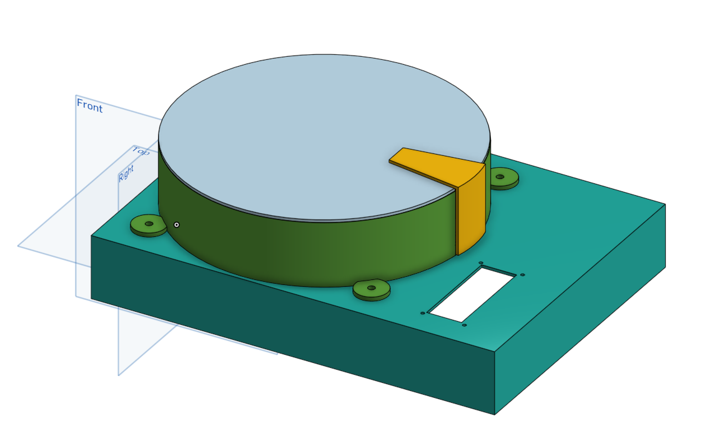
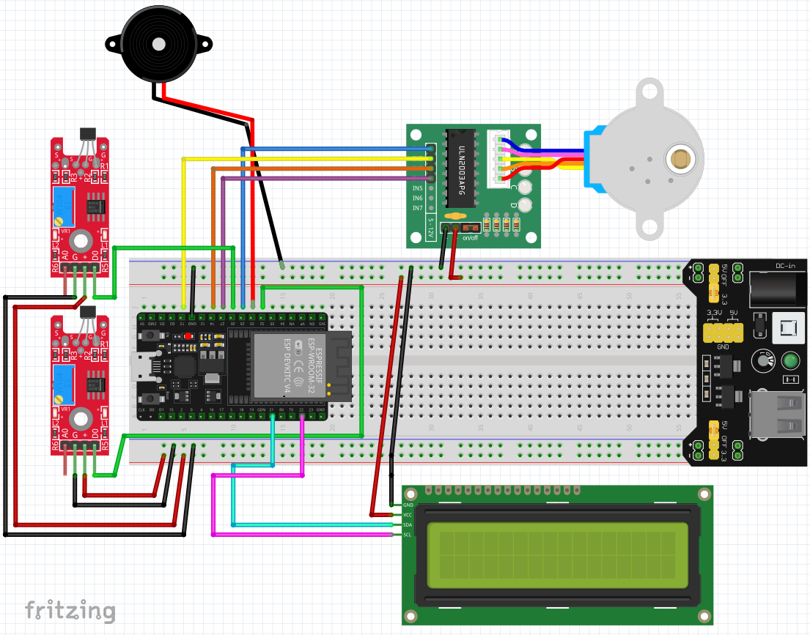
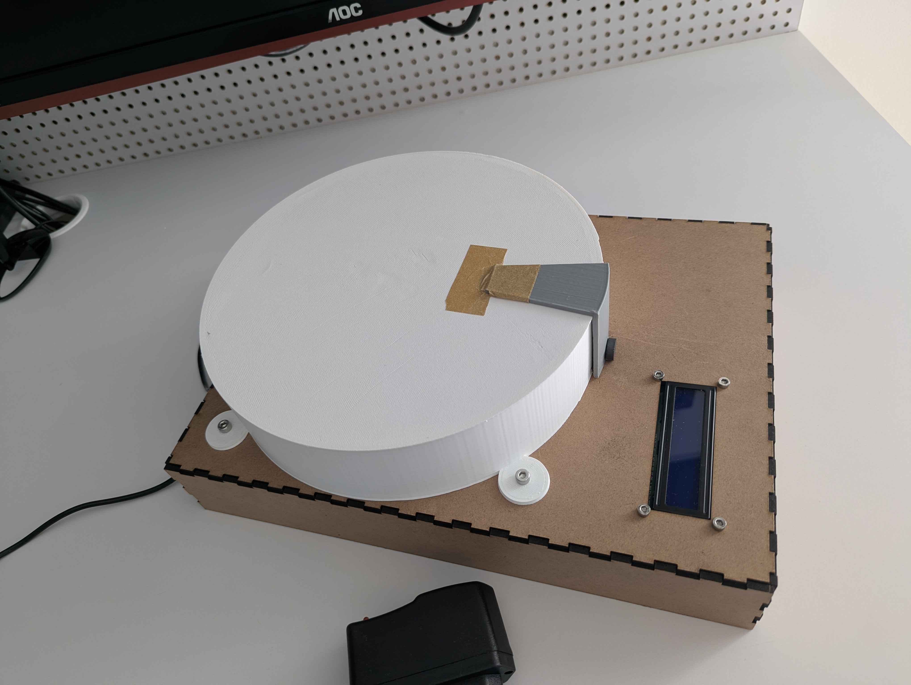
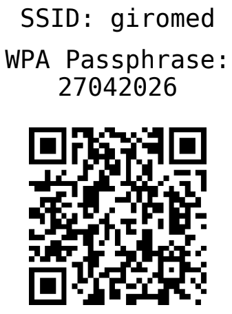

# GiroMed - Smart Medicine Dispenser 

GiroMed is an automated, IoT-enabled medicine dispenser designed for the elderly. Developed as a Computer Engineering Final Graduation Project (TCC), it features a local web interface for scheduling doses, a rotating carousel, and real-time email alerts to assist caregivers and ensure patient safety.

## Project Gallery
*(Here you can see the progression from concept to reality)*

### 3D Design

### Fritzing Simulation

### Real Assembly

---

## Bill of Materials (Hardware)
To build this project, you will need the following components:
* **1x** ESP32 Development Board
* **1x** 28BYJ-48 Stepper Motor (5V)
* **1x** ULN2003 Stepper Motor Driver Board
* **1x** Microswitch / Limit Switch (for Homing/Alignment)
* **1x** MB102 Breadboard Power Supply Module
* Jumper wires (Male-Female and Male-Male)
* Custom 3D Printed Enclosure and Carousel

---

## Software Setup (VS Code + PlatformIO)

### Prerequisites
1. Download and install [Visual Studio Code](https://code.visualstudio.com/).
2. Open VS Code, go to the Extensions tab, search for **PlatformIO IDE**, and install it.

### Installation & Configuration

1. **Open the project:** Open the newly created `GiroMed` folder in VS Code. PlatformIO will automatically initialize the environment and download the required libraries.

2. **Build and Upload:** * Connect your ESP32 to your computer via USB.
   * Look at the bottom blue PlatformIO status bar in VS Code.
   * Click the **"✓" (Build)** button to compile the C++ code.
   * Click the **"→" (Upload)** button to flash the firmware to the ESP32.

3. **Network & Access:** Once the ESP32 is running, you can quickly access the GiroMed dashboard by scanning the QR Code below with your smartphone:
   
   
   
   *(Note: Email alert configurations and schedule programming are all done directly through this web interface).*
   
## Legal Notice and Disclaimer

This project was developed exclusively for academic and educational purposes as part of a University Final Graduation Project (TCC).

**This repository DOES NOT represent a professional medical device, nor has it been tested, approved, or certified by any health regulatory agency.**

The use of this code, electrical schematics, or mechanical designs to build a functional device is at the user's sole and exclusive risk. The author provides no warranties regarding accuracy, reliability, or safety, and **assumes absolutely no liability** for:
* Hardware, mechanical, or software failures.
* Incorrect dispensing of medication (wrong dosage or delayed schedules).
* Any health damages, misuse, or consequences arising from the utilization of this prototype with real patients.

By using any material from this repository, you agree to these terms and the attached MIT License.
